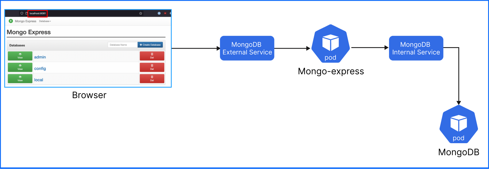

# MongoDB & Mongo-Express-deployment-on-Kubernetes-K8s

## Prerequisite

Make sure Minikube and kubectl are installed.

[kubectl installation](https://kubernetes.io/docs/tasks/tools/install-kubectl/)  
[Minikube installation](https://minikube.sigs.k8s.io/docs/start/)